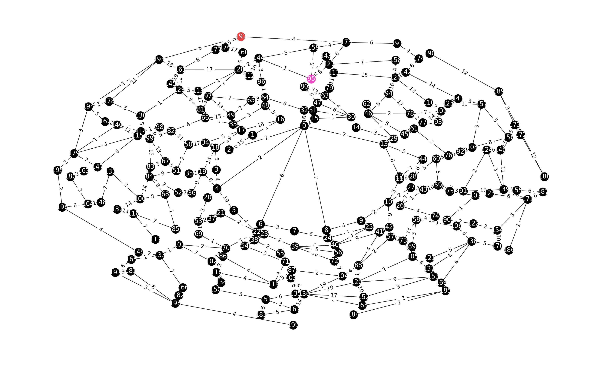
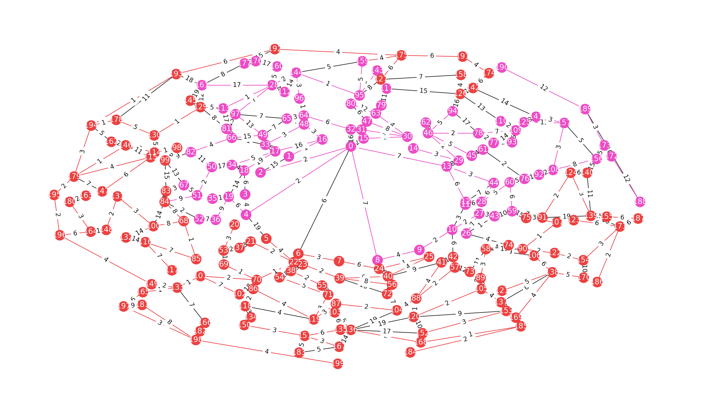

# Stellaris Project

[https://www.stat.berkeley.edu/~aldous/Research/Stel_project/stellaris_project.html](https://www.stat.berkeley.edu/~aldous/Research/Stel_project/stellaris_project.html)


# Requirements

<!-- ## Windows -->
<!-- [X Window](https://www.x.org/wiki/) -->

<!-- ## OSX -->
<!-- [Xquartz](https://www.xquartz.org/) -->


## Common
[conda](https://conda.io/projects/conda/en/latest/index.html)
[conda installation link](https://conda.io/projects/conda/en/latest/user-guide/install/index.html)

Create conda environment and install packages
```bash
conda env create -f environment.yml
```

Activate conda environment
```bash
conda activate stellaris_project 
```


## Triangle build
1. Read and edit the file `makefile` under the triangle folder.
2. After editing `makefile`, under the triangle directory, type `make` to compile triangle.
```bash
cd triangle
make
```


## Basic Scripts

```bash
python generatemap.py
type in a name for the map
map1
```
This will create a bunch of files in the `./maps/map1` directory


```bash
python game.py
type in the map name
map1
```
This will create `./maps/map1/game(number)/start.map` and `./maps/map1/game(number)/result.map`
`start.map` is the map information for the initial state of the game.
 `result.map` is the map information for when the game ended.


```bash
python visualize.py
type in the map directory
./maps/map2/game1
type in the map name
start
```
Result


```bash
python visualize.py
type in the map directory
./maps/map2/game1
type in the map name
result
```
Result

